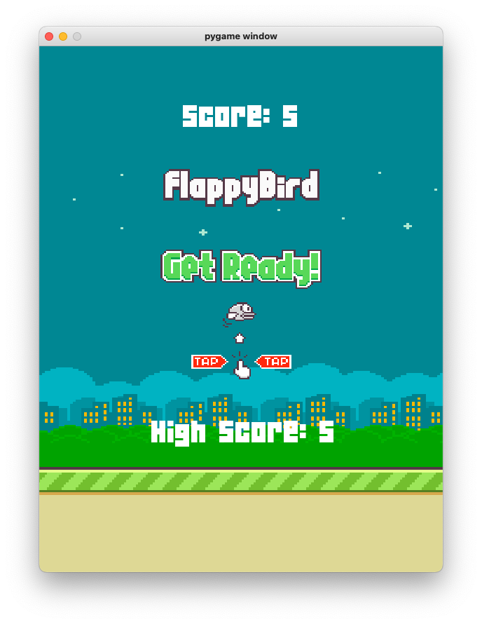

# Flappy Bird



This Flappy Bird game, built with Python and Pygame, is a 2D side-scroller where players navigate a bird through randomly generated pipes by flapping its wings with the spacebar. Featuring smooth physics, collision detection, and a scoring system, it showcases my skills in game development and Pygame’s sprite and event-handling capabilities. The simple yet addictive design is presented in a 400x600 window with a scrolling background.

## Installation Instructions
### Step 1: Get the code
```bash
git clone https://github.com/mattjacobs23/flappy_bird.git
cd flappy_bird
```

### Step 2: Set Up a Virtual Environment (Recommended)
```bash
# Create a virtual environment
python -m venv venv

# Activate the virtual environment
# On Windows:
venv\Scripts\activate

# On Mac:
source venv/bin/activate
```

### Step 3: Install Requirements
```bash
pip install -r requirement.txt
```

### Step 4: Run the Game
```bash
python main.py
```

#### Controls
- Press `SPACE` to make the bird flap
